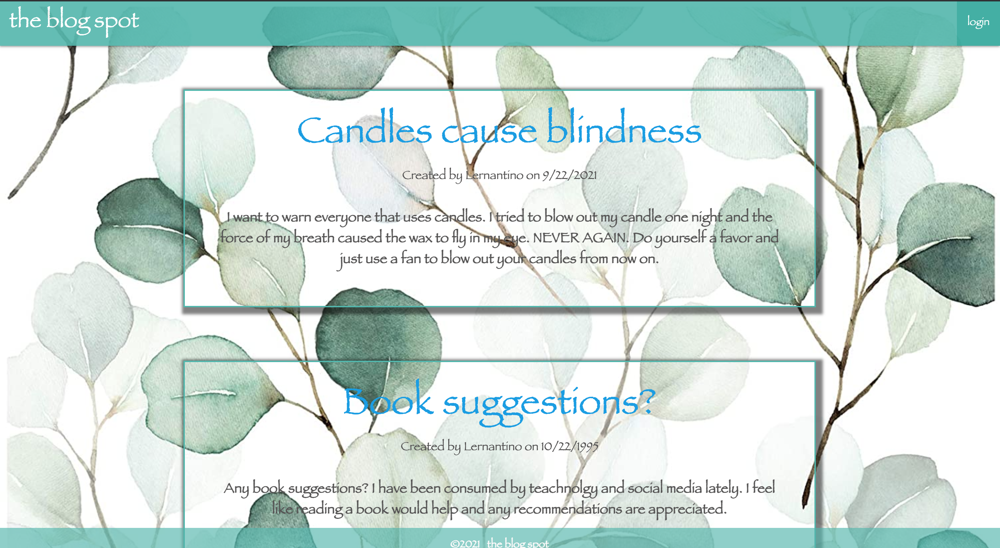
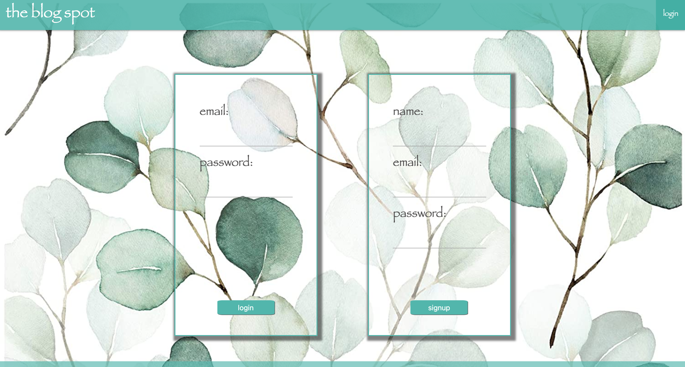
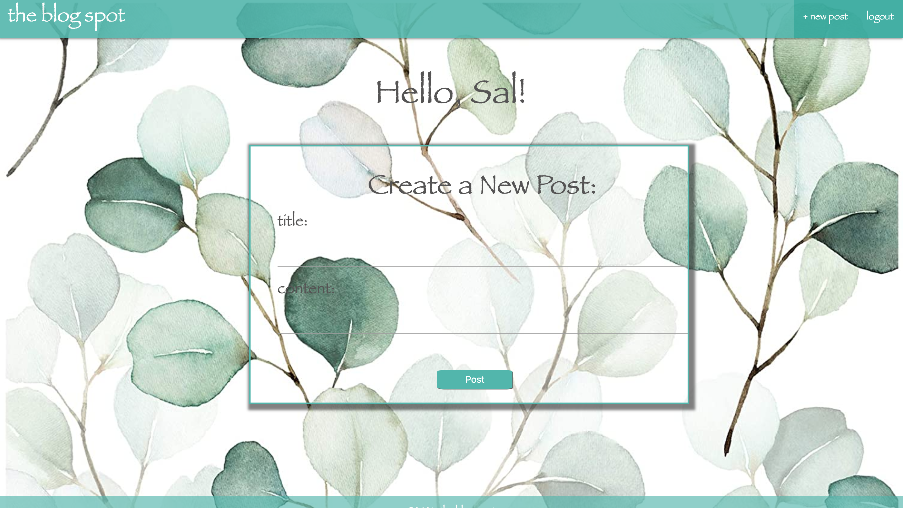

# The Blog Spot

# Description

This is a website that allows users to post in a blog like setting. 
When user first enters the site, they are greeted with the homepage contained all the past posts. 

When user clicks on login button, they will be directed to a login page that also contains a signup form
in case they are new users and dont have login already. 

Once logged in, user can create new posts. 

# Link

Deployed site: https://thawing-lowlands-43130.herokuapp.com/
GitHub Repository: https://github.com/aydanegash/blog-post

# Liscense 

MIT Liscense 